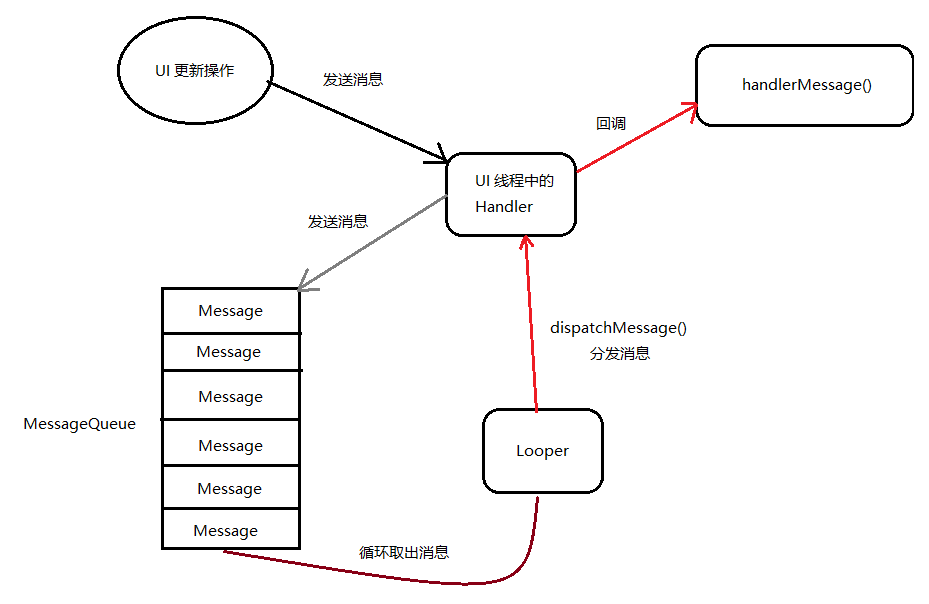

Android 的消息机制主要由 Handler,Looper,MessageQueue,Message 等组成,而 Handler 的运行主要依赖后三者;


# 源码分析

Handler 的消息处理主要有五个部分, Message, Handler, MessageQueue, Looper, Threadlocal.

方法|作用
-|-
Messager|Message 是线程之间传递的消息,他可以在内部携带少量的数据,用于线程之间交换数据, Message 有四个常用字段,what,arg1,arg2,obj.其中what,arg1,arg2可以携带整型数据,而 obj 可以携带 object 对象.
Handler|它主要用于发送和处理消息的发送消息一般使用的是sendMessage() 方法,还有其他一系列的sendXXX方法,但是最终都是调用了 sendMessageAtTime() 方法, 除了 sendMessageAtTime() 这个方法而发出的消息经过一系列的辗转处理后，最终会传递到 Handler的handleMessage() 方法中。
MessageQueue|MessageQqueue 是消息队列的意思,它主要用来存放所有通过 Handler 发送的消息,这部分的消息会一直存在消息队列中,按进入队列的时间顺序依次等待被处理. **每一个线程中都会有一个 MessageQueue 对象.**
Looper|每个线程通过 Handler 发送的消息都保存在 MessageQueue 中,而 Looper 通过调用 loop() 方法,就会进入一个无线循环中,然后发现一个 MessageQueue 中存在一条消息就将它取出来,并传递给 Handler.handlermessage() 方法中.**每一个线程只会存在一个 Looper 对象**
ThreadLocal|MessageQueue 对象,和 Looper 对象在每个线程中都会有一个对象,那么我们怎么保证他只有一个对象呢?单利?静态?其实使用通过 ThreadLocal 来保存.ThreadLocal 是一个线程内部的数据类,他可以在指定线程中存储数据,数据存储后,只能由指定的线程获取,而其他的线程则不可获取到数据.

在了解到这些基本的概念以后我们就来深入的看一看 Handler 的工作机制.

# MessageQueue 的工作原理

MessageQueue 消息队列是通过一个单链表的数据结构来维护消息链表.下面最主要看 enqueueMessage 方法和 next() 方法.
	
```java
boolean enqueueMessage(Message msg, long when) {
        if (msg.target == null) {
            throw new IllegalArgumentException("Message must have a target.");
        }
        if (msg.isInUse()) {
            throw new IllegalStateException(msg + " This message is already in use.");
        }

        synchronized (this) {
            if (mQuitting) {
                IllegalStateException e = new IllegalStateException(
                        msg.target + " sending message to a Handler on a dead thread");
                Log.w(TAG, e.getMessage(), e);
                msg.recycle();
                return false;
            }

            msg.markInUse();
            msg.when = when;
            Message p = mMessages;
            boolean needWake;
            if (p == null || when == 0 || when < p.when) {
                // New head, wake up the event queue if blocked.
                msg.next = p;
                mMessages = msg;
                needWake = mBlocked;
            } else {
                // Inserted within the middle of the queue.  Usually we don't have to wake
                // up the event queue unless there is a barrier at the head of the queue
                // and the message is the earliest asynchronous message in the queue.
                needWake = mBlocked && p.target == null && msg.isAsynchronous();
                Message prev;
                for (;;) {
                    prev = p;
                    p = p.next;
                    if (p == null || when < p.when) {
                        break;
                    }
                    if (needWake && p.isAsynchronous()) {
                        needWake = false;
                    }
                }
                msg.next = p; // invariant: p == prev.next
                prev.next = msg;
            }

            // We can assume mPtr != 0 because mQuitting is false.
            if (needWake) {
                nativeWake(mPtr);
            }
        }
        return true;
    }
```

可以看出来,这个方法主要是根据时间顺序向表单中插入一条消息.
那么 next() 又是用来干什么呢?
我们继续看下去:

```java
Message next() {
        // Return here if the message loop has already quit and been disposed.
        // This can happen if the application tries to restart a looper after quit
        // which is not supported.
        final long ptr = mPtr;
        if (ptr == 0) {
            return null;
        }

        int pendingIdleHandlerCount = -1; // -1 only during first iteration
        int nextPollTimeoutMillis = 0;
        for (;;) {
            if (nextPollTimeoutMillis != 0) {
                Binder.flushPendingCommands();
            }

            nativePollOnce(ptr, nextPollTimeoutMillis);

            synchronized (this) {
                // Try to retrieve the next message.  Return if found.
                final long now = SystemClock.uptimeMillis();
                Message prevMsg = null;
                Message msg = mMessages;
                if (msg != null && msg.target == null) {
                    // Stalled by a barrier.  Find the next asynchronous message in the queue.
                    do {
                        prevMsg = msg;
                        msg = msg.next;
                    } while (msg != null && !msg.isAsynchronous());
                }
                if (msg != null) {
                    if (now < msg.when) {
                        // Next message is not ready.  Set a timeout to wake up when it is ready.
                        nextPollTimeoutMillis = (int) Math.min(msg.when - now, Integer.MAX_VALUE);
                    } else {
                        // Got a message.
                        mBlocked = false;
                        if (prevMsg != null) {
                            prevMsg.next = msg.next;
                        } else {
                            mMessages = msg.next;
                        }
                        msg.next = null;
                        if (DEBUG) Log.v(TAG, "Returning message: " + msg);
                        msg.markInUse();
                        return msg;
                    }
                } else {
                    // No more messages.
                    nextPollTimeoutMillis = -1;
                }

                // Process the quit message now that all pending messages have been handled.
                if (mQuitting) {
                    dispose();
                    return null;
                }

                // If first time idle, then get the number of idlers to run.
                // Idle handles only run if the queue is empty or if the first message
                // in the queue (possibly a barrier) is due to be handled in the future.
                if (pendingIdleHandlerCount < 0
                        && (mMessages == null || now < mMessages.when)) {
                    pendingIdleHandlerCount = mIdleHandlers.size();
                }
                if (pendingIdleHandlerCount <= 0) {
                    // No idle handlers to run.  Loop and wait some more.
                    mBlocked = true;
                    continue;
                }

                if (mPendingIdleHandlers == null) {
                    mPendingIdleHandlers = new IdleHandler[Math.max(pendingIdleHandlerCount, 4)];
                }
                mPendingIdleHandlers = mIdleHandlers.toArray(mPendingIdleHandlers);
            }

            // Run the idle handlers.
            // We only ever reach this code block during the first iteration.
            for (int i = 0; i < pendingIdleHandlerCount; i++) {
                final IdleHandler idler = mPendingIdleHandlers[i];
                mPendingIdleHandlers[i] = null; // release the reference to the handler

                boolean keep = false;
                try {
                    keep = idler.queueIdle();
                } catch (Throwable t) {
                    Log.wtf(TAG, "IdleHandler threw exception", t);
                }

                if (!keep) {
                    synchronized (this) {
                        mIdleHandlers.remove(idler);
                    }
                }
            }

            // Reset the idle handler count to 0 so we do not run them again.
            pendingIdleHandlerCount = 0;

            // While calling an idle handler, a new message could have been delivered
            // so go back and look again for a pending message without waiting.
            nextPollTimeoutMillis = 0;
        }
    }
```

在 next 中有一个关键方法 `for (;;)` 对就是这个死循环,慢慢梳理代码我们不难看出如果有消息返回就从链表中移除.没有消息的时候就会一直柱塞在这里

# Looper

在一个 Android 启动应用的时候,会创建一个主线程, 也就是UI线程.而这个主线程 ActivityThread 中的一个静态的 main 方法. 这个 main 方法也就是我们应用程序的入口点. 我们来简单的看一下这个 main 方法.

```java
public static void main(String[] args) {

    ......

    Looper.prepareMainLooper();

    ActivityThread thread = new ActivityThread();
    thread.attach(false);

    ......

    Looper.loop();

    throw new RuntimeException("Main thread loop unexpectedly exited");
}
```

从上面的方法中我们可以看出来,使用了 `Looper.prepareMainLooper()` 方法为主线程创建了 Looper 以及 MessageQueue, 并通过`Looper.loop()` 来开心主线程的消息循环.

```java
public static void prepareMainLooper() {
    prepare(false);
    synchronized (Looper.class) {
        if (sMainLooper != null) {
            throw new IllegalStateException("The main Looper has already been prepared.");
        }
        sMainLooper = myLooper();
    }
}
```

这个方法中调用了 `prepare(false);`方法和 `myLooper();` 方法

```java
private static void prepare(boolean quitAllowed) {
    if (sThreadLocal.get() != null) {
        throw new RuntimeException("Only one Looper may be created per thread");
    }
    sThreadLocal.set(new Looper(quitAllowed));
}
```

在这里 sThreadLocal 对象保存了一个 Looper 对象,以防止被调用两次.sThreadLocal 对象是 ThreadLocal 类型，因此保证了每个线程中只有一个 Looper 对象。
那么 Looper 到底干了什么?

```java
private Looper(boolean quitAllowed) {
    mQueue = new MessageQueue(quitAllowed);
    mThread = Thread.currentThread();
}
```

果不其然,在 Looper 的构造函数中创建一个 MessageQueue 对象和保存了当前的线程.从之前的代码中可以看出一个线程只能有一个 Looper 对象,而 MessageQueue 又是在 Looper 构造函数中创建出来的,因此每一个线程也只有一个 MessageQueue 对象;
还有一个 prepare 的重载方法;

```java
public static void prepare() {
    prepare(true);
}
```

`prepare()` 仅仅是对 `prepare(boolean quitAllowed)` 的封装,这里就是解释了主线程不需要调用 `Looper.prepare()` 方法了.因为主线程在启动的时候已经很贴心的帮我们调用了啊!

然后在说说我们在 `Looper.perpareMainLooper()` 方法中的 `myLooper()`

```java
/**
 * Return the Looper object associated with the current thread.  Returns
 * null if the calling thread is not associated with a Looper.
 */
public static Looper myLooper() {
    return sThreadLocal.get();
}
```

这串英文是什么意思呢? 让我们请出我们可爱谷歌娘:返回与当前线程关联的Looper对象。 如果调用线程未与Looper关联，则返回null。
有没有很清楚一下就明白了.就是取出我们当前线程中的 Looper 对象,保存在 sMainLooper 瞧瞧这命名方式多简单易懂;

我是不是忘记了什么?
哦!对了还有一个方法: `Looper.loop()` main 还调用了这个方法是用来干什么的呢?

```java
public static void loop() {
        final Looper me = myLooper();
        if (me == null) {
            throw new RuntimeException("No Looper; Looper.prepare() wasn't called on this thread.");
        }
        final MessageQueue queue = me.mQueue;

        // Make sure the identity of this thread is that of the local process,
        // and keep track of what that identity token actually is.
        Binder.clearCallingIdentity();
        final long ident = Binder.clearCallingIdentity();

        for (;;) {
            Message msg = queue.next(); // might block
            if (msg == null) {
                // No message indicates that the message queue is quitting.
                return;
            }

            // This must be in a local variable, in case a UI event sets the logger
            Printer logging = me.mLogging;
            if (logging != null) {
                logging.println(">>>>> Dispatching to " + msg.target + " " +
                        msg.callback + ": " + msg.what);
            }

            msg.target.dispatchMessage(msg);

            if (logging != null) {
                logging.println("<<<<< Finished to " + msg.target + " " + msg.callback);
            }

            // Make sure that during the course of dispatching the
            // identity of the thread wasn't corrupted.
            final long newIdent = Binder.clearCallingIdentity();
            if (ident != newIdent) {
                Log.wtf(TAG, "Thread identity changed from 0x"
                        + Long.toHexString(ident) + " to 0x"
                        + Long.toHexString(newIdent) + " while dispatching to "
                        + msg.target.getClass().getName() + " "
                        + msg.callback + " what=" + msg.what);
            }

            msg.recycle();
        }
}
```

快看是 next() 方法,是不是好像在刚刚的 MessageQueue 方法中看到了?
对就是这样,从这个方法里进入一个无限循环，不断的从 MessageQueue 的 next 方法获取消息,而next方法是一个阻塞操作，当没有消息的时候就一直在阻塞,当有消息通过 `msg.target.dispatchMessage(msg);`  这里的msg.target其实就是发送给这条消息的Handler对象。那么我们就去看看 Handle 又干了什么;

# Handler

构造方法

```java
public Handler(Callback callback) {
    this(callback, false);
}

public Handler(Looper looper) {
    this(looper, null, false);
}

public Handler(Looper looper, Callback callback) {
    this(looper, callback, false);
}
```

怎么都要传递 Looper 我们没有怎么办,那就看看不需要传递 Looper 的构造函数

```java
public Handler(Callback callback, boolean async) {
    if (FIND_POTENTIAL_LEAKS) {
        final Class<? extends Handler> klass = getClass();
        if ((klass.isAnonymousClass() || klass.isMemberClass() || klass.isLocalClass()) &&
                (klass.getModifiers() & Modifier.STATIC) == 0) {
            Log.w(TAG, "The following Handler class should be static or leaks might occur: " +
                klass.getCanonicalName());
        }
    }

    mLooper = Looper.myLooper();
    if (mLooper == null) {
        throw new RuntimeException(
            "Can't create handler inside thread that has not called Looper.prepare()");
    }
    mQueue = mLooper.mQueue;
    mCallback = callback;
    mAsynchronous = async;
}
```

什么? 当 Looper 为 null 竟然抛出了 `Can't create handler inside thread that has not called Looper.prepare()` 异常,这样我们知道为什么在子线程中使用 Handler 时要手动调用 `Looper.prepare()` 方法了,原来是用来创建一个 Looper 对象.那么主线程为什么不用呢?因为服务周到的主线程已经在创建的时候就自己调用了 `Looper.prepare()` 方法了.

Handler 的工作主要事实包含发送和接收过程.其中 post 和 send 的一系列方法主要是用俩发送消息.但是 post 其实最终也会通过 ssend 的一系列方法来实现的. 而 send 的一系列方法最终会通过 sendMessageAtTime 方法来实现.来我们看看 send 的一系列方法:

```java
public final boolean sendMessage(Message msg)
    {
        return sendMessageDelayed(msg, 0);
    }

    public final boolean sendEmptyMessage(int what)
    {
        return sendEmptyMessageDelayed(what, 0);
    }  

    public final boolean sendEmptyMessageAtTime(int what, long uptimeMillis) {
        Message msg = Message.obtain();
        msg.what = what;
        return sendMessageAtTime(msg, uptimeMillis);
    }

    public final boolean sendMessageDelayed(Message msg, long delayMillis)
    {
        if (delayMillis < 0) {
            delayMillis = 0;
        }
        return sendMessageAtTime(msg, SystemClock.uptimeMillis() + delayMillis);
    }

    public boolean sendMessageAtTime(Message msg, long uptimeMillis) {
        MessageQueue queue = mQueue;
        if (queue == null) {
            RuntimeException e = new RuntimeException(
                    this + " sendMessageAtTime() called with no mQueue");
            Log.w("Looper", e.getMessage(), e);
            return false;
        }
        return enqueueMessage(queue, msg, uptimeMillis);
    }

    public final boolean sendMessageAtFrontOfQueue(Message msg) {
        MessageQueue queue = mQueue;
        if (queue == null) {
            RuntimeException e = new RuntimeException(
                this + " sendMessageAtTime() called with no mQueue");
            Log.w("Looper", e.getMessage(), e);
            return false;
        }
        return enqueueMessage(queue, msg, 0);
    }

    private boolean enqueueMessage(MessageQueue queue, Message msg, long uptimeMillis) {
        msg.target = this;
        if (mAsynchronous) {
            msg.setAsynchronous(true);
        }
        return queue.enqueueMessage(msg, uptimeMillis);
    }
```


这里我们可以看出,handler 发送的消息其实就是将消息插入消息队列,在 Looper 的 loop 方法中从 MessageQueue 中取出并调用 `msg.target.dispatchMessage(msg)` ;而这个其实就是就是在调用 Handler 的 `dispatchMessage(msg)` :

```java
/**
 * Handle system messages here.
 */
public void dispatchMessage(Message msg) {
    if (msg.callback != null) {
        handleCallback(msg);
    } else {
        if (mCallback != null) {
            if (mCallback.handleMessage(msg)) {
                return;
            }
        }
        handleMessage(msg);
    }
}
```

先最一个非空判断,非空时调用了 `handleCallback(msg);` 来处理消息,那么 `msg.callback` 是什么东西啊? 其实这里的 `msg.callback` 就是一个 Runnable对象, 也就是 Handler 发送过来的 post 对象.先看看 post 的对象的方法;
	
```java
public final boolean post(Runnable r)
{
   return  sendMessageDelayed(getPostMessage(r), 0);
}

 public final boolean postAtTime(Runnable r, long uptimeMillis)
{
    return sendMessageAtTime(getPostMessage(r), uptimeMillis);
}

public final boolean postAtTime(Runnable r, Object token, long uptimeMillis)
{
    return sendMessageAtTime(getPostMessage(r, token), uptimeMillis);
}
```


	
```java
public final boolean postDelayed(Runnable r, long delayMillis)
{
    return sendMessageDelayed(getPostMessage(r), delayMillis);
}
```


	
```java
public final boolean postAtFrontOfQueue(Runnable r)
{
    return sendMessageAtFrontOfQueue(getPostMessage(r));
}

private static Message getPostMessage(Runnable r) {
    Message m = Message.obtain();
    m.callback = r;
    return m;
}
```

好了我们在看看 `msg.callback` 非空时 `handleCallback(msg)` 是做了什么:

```java
private static void handleCallback(Message message) {
    message.callback.run();
}
```

emmmmm... 果然就是很简单的回调了 Runnable 对象的 run 方法. 其实吧我们去看看 Activity 中的 runOnUiThread 和 View 中的 postDelayed 方法也是使用了同样的原理，我们先看看 runOnUiThread 方法:

```java
public final void runOnUiThread(Runnable action) {
	if (Thread.currentThread() != mUiThread) {
	    mHandler.post(action);
	} else {
	    action.run();
	}
}
```

View 的 postDelayed 方法:

```java
public boolean postDelayed(Runnable action, long delayMillis) {
	final AttachInfo attachInfo = mAttachInfo;
	if (attachInfo != null) {
	    return attachInfo.mHandler.postDelayed(action, delayMillis);
	}
	// Assume that post will succeed later
	ViewRootImpl.getRunQueue().postDelayed(action, delayMillis);
	return true;
}
```

实质上都是在 UI 线程中执行 Runnable 中的 run 方法.

在回来看看 msg.callback 为空的时候会对 mCallback 进行非空判断,而 mCallback 又使用一个接口的引用:

```java
/**
 * Callback interface you can use when instantiating a Handler to avoid
 * having to implement your own subclass of Handler.
 *
 * @param msg A {@link android.os.Message Message} object
 * @return True if no further handling is desired
 */
public interface Callback {
    public boolean handleMessage(Message msg);
}
```

原来 CallBack 其实就是另一种使用 Handler 的方式啊, 看来既可以派生子类重写 handleMessage() 的方法也可以通过设置 CallBack 来实现.

# 总结

 首先在主线程创建一个 Handler 对象 ，并重写 handleMessage（）方法。然后当在子线程中需要进行更新 UI 的操作，我们就创建一个 Message 对象，并通过 handler 发送这条消息出去。之后这条消息被加入到 MessageQueue 队列中等待被处理，通过 Looper 对象会一直尝试从 MessageQueue 中取出待处理的消息，最后分发会 Handler 的 handlerMessage() 方法中。

最后来一张我话的流程图:


