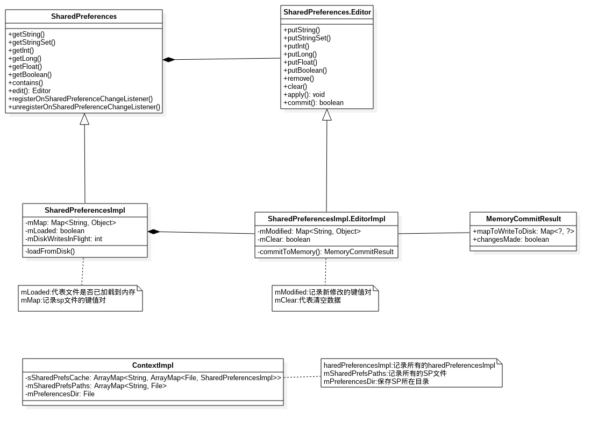
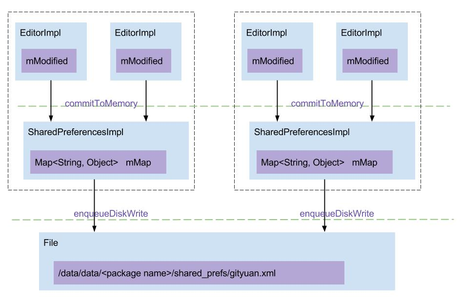

# SharedPreferences 学习

## 一. 概述
　　<SharedPreferences(简称 SP)是 Android 中很常用的数据存储方式， SP 采用 key-value（键值对）形式, 主要用于轻量级的数据存储, 尤其适合保存应用的配置参数, 但不建议使用 SP 来存储大规模的数据, 可能会降低性能.

　　SP 采用 xml 文件格式来保存数据, 该文件所在目录位于 /data/data//shared_prefs/

### 1.1 使用试例

	SharedPreferences sharedPreferences = getSharedPreferences("gityuan", Context.MODE_PRIVATE);

	Editor editor = sharedPreferences.edit();
	editor.putString("blog", "www.gityuan.com");
	editor.putInt("years", 3);
	editor.commit();
生成的gityuan.xml文件内容如下：

	<?xml version='1.0' encoding='utf-8' standalone='yes' ?>
	<map>
	   <string name="blog">"www.gityuan.com</string>
	   <int name="years" value="3" />
	</map>

### 1.2 架构图

SharedPreferences与Editor只是两个接口. SharedPreferencesImpl和EditorImpl分别实现了对应接口. 另外, ContextImpl记录着SharedPreferences的重要数据, 如下:

* sSharedPrefsCache:以包名为key, 二级key是以SP文件, 以SharedPreferencesImpl为value的嵌套map结构. 这里需要sSharedPrefsCache是静态类成员变量, 每个进程是保存唯一一份, 且由ContextImpl.class锁保护.
* mSharedPrefsPaths:记录所有的SP文件, 以文件名为key, 具体文件为value的map结构;
* mPreferencesDir:是指SP所在目录, 是指/data/data//shared_prefs/

图解:
 1. putxxx()操作: 把数据写入到EditorImpl.mModified;
 2. apply()或者commit()操作:
	 * 先调用commitToMemory(), 将数据同步到SharedPreferencesImpl的mMap, 并保存到MemoryCommitResult的mapToWriteToDisk,
	 * 再调用enqueueDiskWrite(), 写入到磁盘文件; 先之前把原有数据保存到.bak为后缀的文件,用于在写磁盘的过程出现任何异常可恢复数据;
 3. getxxx()操作: 从SharedPreferencesImpl.mMap读取数据. 

## 二. SharedPreferences
### 2.1 获取方式
#### 2.1.1 getPreferences
	public SharedPreferences getPreferences(int mode) {
	    //[见下文]
	    return getSharedPreferences(getLocalClassName(), mode);
	}
Activity.getPreferences(mode): 以当前Activity的类名作为SP的文件名. 即xxxActivity.xml.