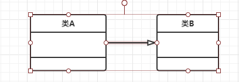
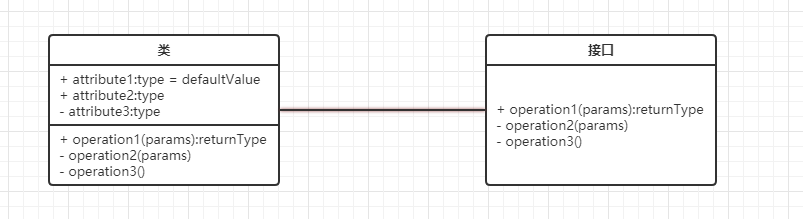
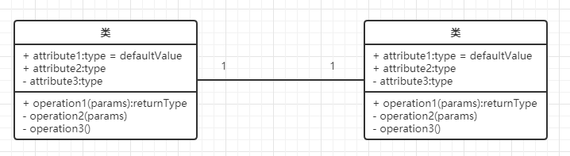
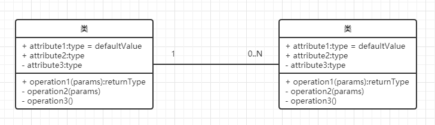
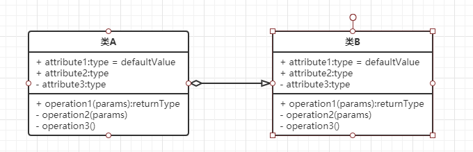
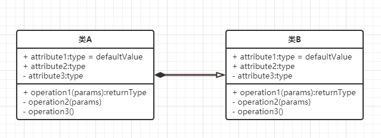

#UML 类图学习
---
类图是用来梳理代码结构和业务逻辑的神器所以,学习类图的使用就是一个必备技能了,在学习类图前我们需知道制作 UML 的软件有哪些:

##软件
制作 UML 的的工具大体分为两种一种是线上的,一种是线下的,线上的有ProcessOn等;线下的有 等;

 类与类之间由弱到强关系是: **没关系 > 依赖 > 关联 > 聚合 > 组合。**

##UML 类图各符号含义
1. 泛化(继承)
	>A继承B
	>
	> 

2. 实现
 	> 类实现了接口
	>
	> 

3. 关联
	1. 单项关联
		> 使用是我持有你,但是你并不持有我的对象
		> 一对一
		> 
		> 
	2. 双向关联
		> 我持有你对象,你也持有我对象,
		> 可以是一对多
		> 
		> 
	3. 聚合
		>图中的意思是A类聚合了B类但是,B类没有A类也有存在的必要
		>
		> 
	4. 组合
		> 和聚合类似不过,B类离开了A类就没有了存在的意义
		> 
		> 
4. 依赖
	> A类使用了B类中的某个数据,并使用B类中的某个数据完成业务逻辑,就像我在B中定义一个字段:`public static final int typ = 1;` 我在A类种去使用了这个字段,而这种使用关系是具有偶然性的、、临时性的、非常弱的
	> 
	> 