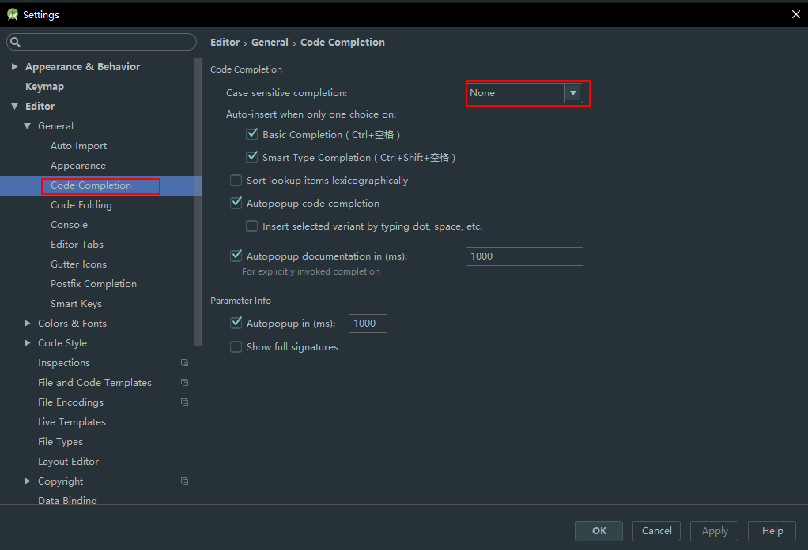
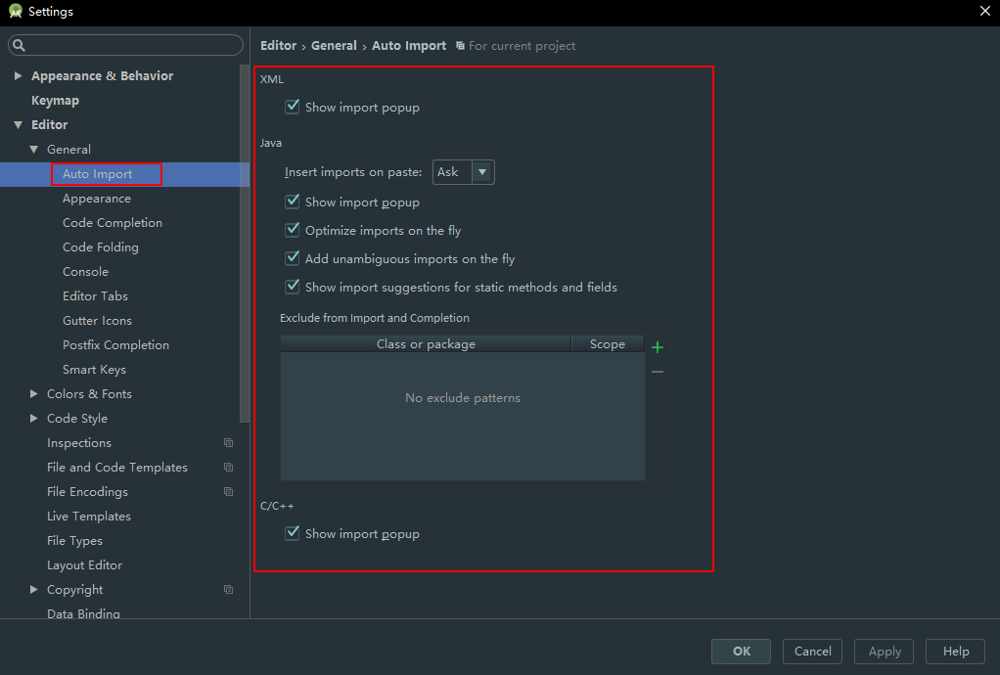
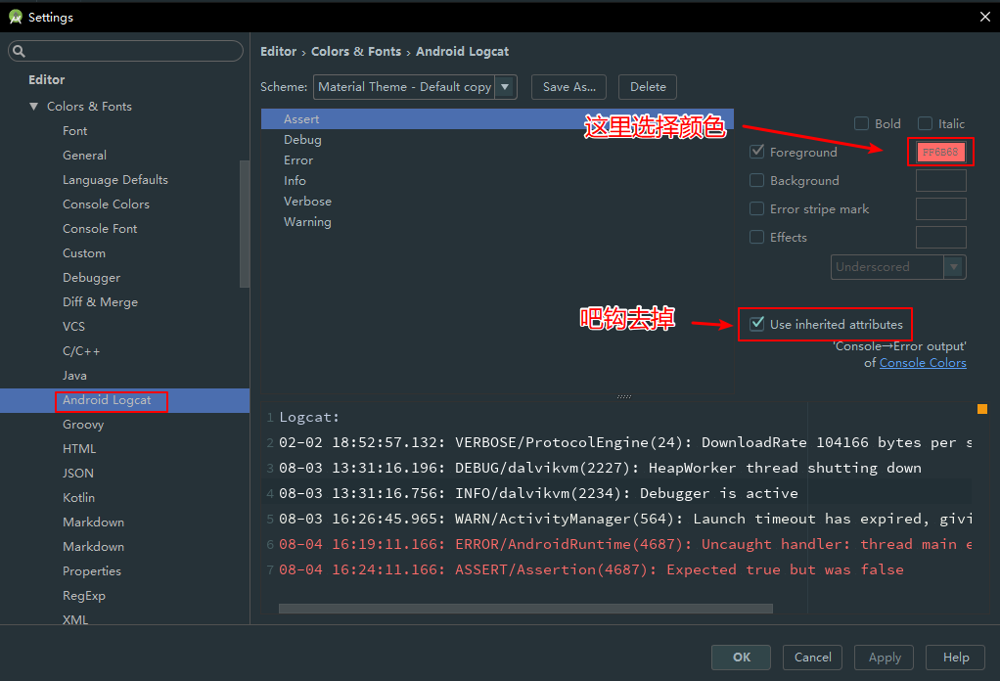
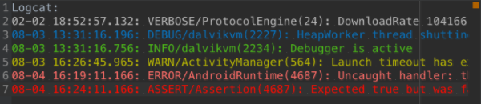
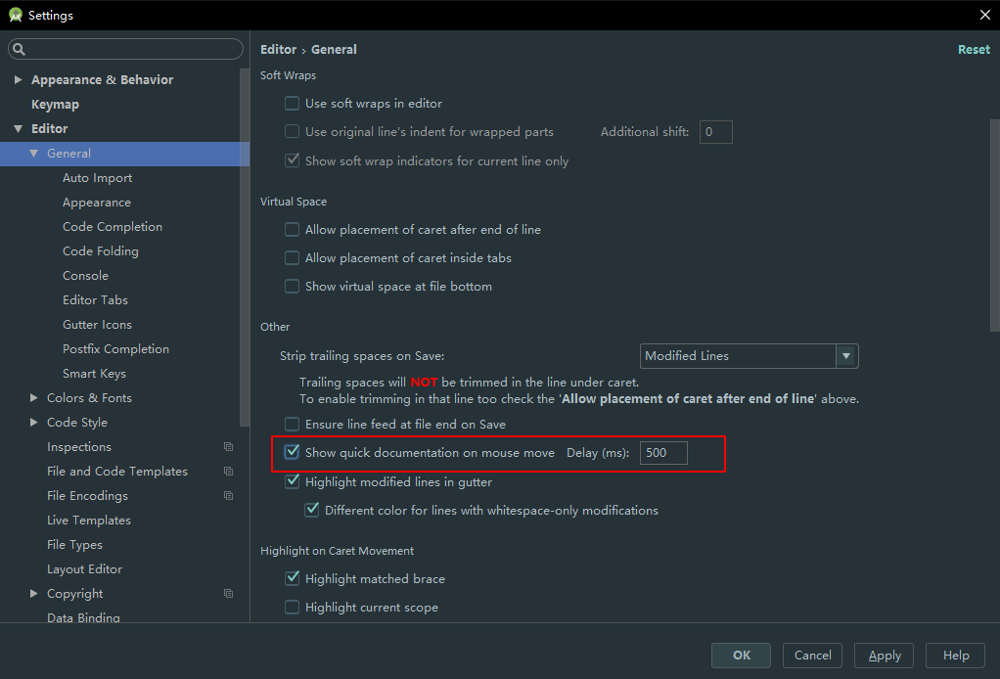
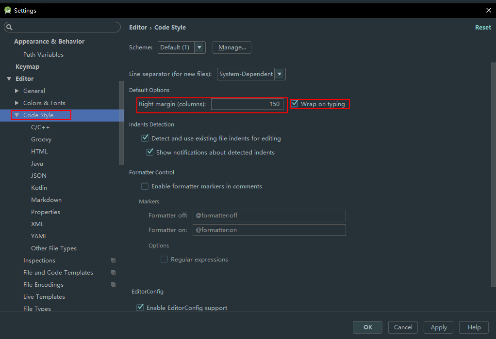
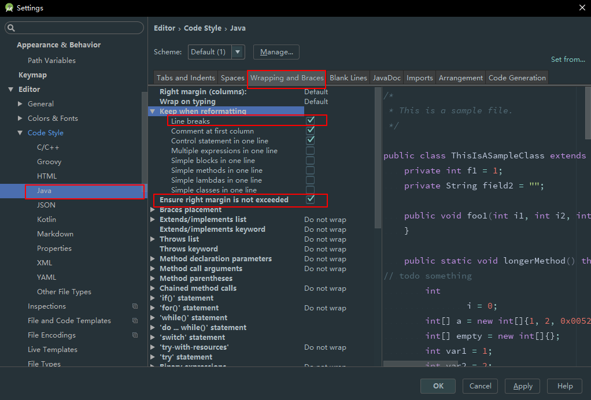
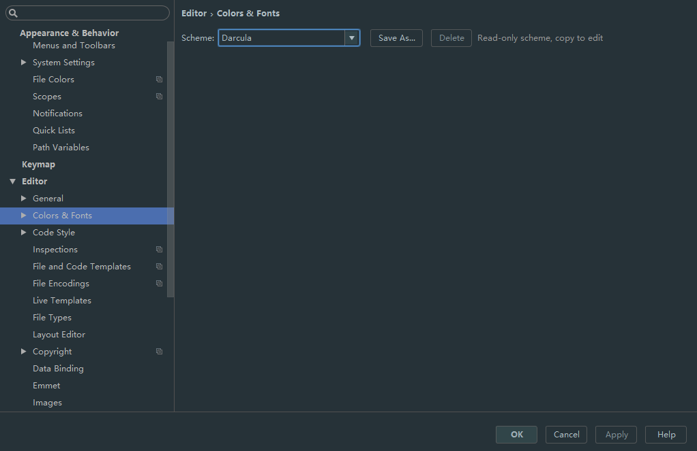
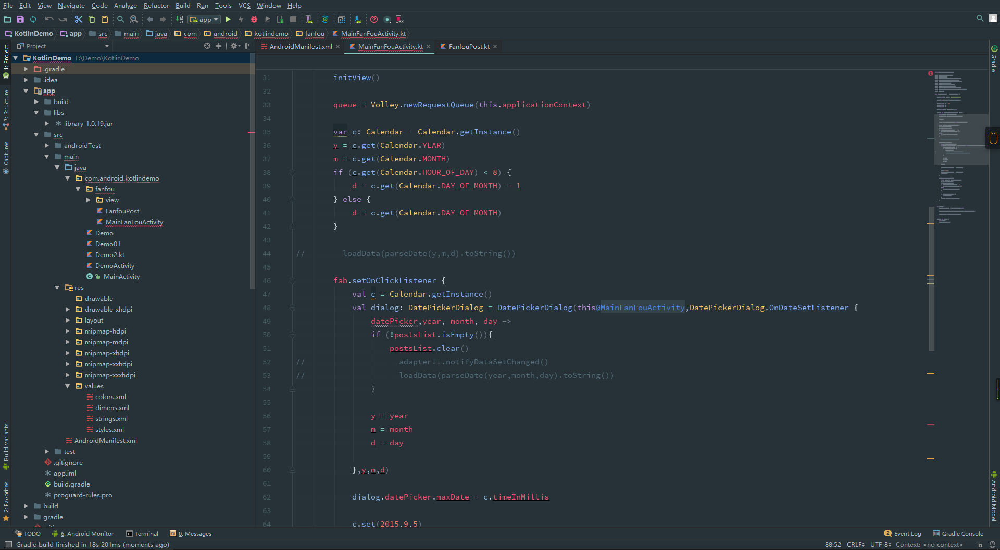
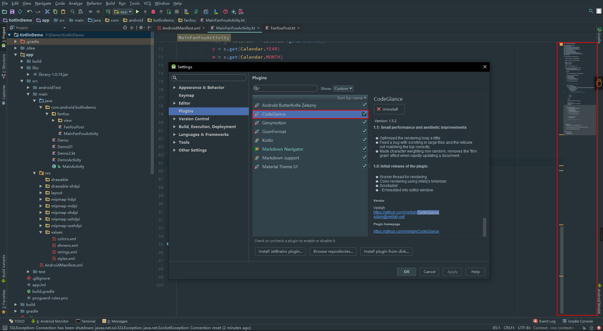

> # Android Studio 安装

　　Android 的开发不一定必须使用 Android Studio,但是 Android Studio 被谷歌指定为御用的开发工具,功能不可谓不强大;尤其是代码提示和搜索功能非常强大，非常智能。在就是:

1. 颜色、图片在布局和代码中可以实时预览
2. string可以实时预览
3. 多屏预览、截图带有设备框，可随时录制模拟器视频
4. 可以直接打开文件所在位置
5. 跨工程移动、搜索、跳转
6. 自动保存，无需一直Ctrl + S
7. 即使文件关闭依然可以回退N个历史
8. 智能重构、智能预测报错
9. 每一行文件编辑历史，可追溯到人 
10. 各种插件：例如ADB、.gitignore、sql、markdown、
11. 图片可直接转.9图片,并且自带.9编辑
12. 在gradle编译时使用aar依赖超级方便
13. 还有很多...

　　介绍好处肯定要去告诉你去怎么使用了,那么肯定要去下载了,鉴于 Google在中国尴尬的境地你上不去[官网](https://developer.android.com/index.html)就去[Android Studio 中文网](http://www.android-studio.org/)下载;建议下载包含 Android SDK 的这样你就不要再去下载 SDK 直接就可以使用了,虽然 Studio 下载SDK也很容易.

> # Android Studio 配置

　　上面的一开始没打算去写毕竟笔记以后或许要发到博客去所以就补上了.言归正传,开始我们的配置;

> ## 常用快捷键
　　这里只是我常用的快捷键,不是最全的,但是都是最实用的,键位是 AS 默认的:

* F2 -> 跳转到错误处
* ctrl+alt+v -> ctrl+2+l 自动定义变量
* ctrl+alt+l -> ctrl+shift+f 代码格式化
* ctrl+alt+o -> ctrl+shift+o 导包
* ctrl+alt+F -> 自动生成成员变量
* ctrl+r -> 替换字符串
* ctrl+n -> 查找类
* ctrl+d -> 复制当前行
* Ctrl+shift+↑/↓ -> 移动当前行
* ctrl+f12 -> 当前类查找方法
* ctrl+alt+space -> 自动提示
* ctrl+alt+Left/Right ->跳到上一个/下一个编辑页面
* alt+enter -> ctrl+1, 自动修正
* ctrl+y -> 删除当前行
* ctrl+shift+f -> 全局查找
* ctrl+p ->查看参数
* ctrl+alt+b -> ctrl+t,查看继承关系
* ctrl+Q 查看当前方法注释
* ctrl+alt+t : 自动生成代码块, 比如try catch等

> ## 修改debug签名

	signingConfigs {
	    config {
	        keyAlias 'itcast'
	        keyPassword '123456'
	        storeFile file('C:/Users/Administrator/Desktop/itcast.keystore.jks')
	        storePassword '123456'
	    }
	}
	
	buildTypes {
	    release {
	        signingConfig signingConfigs.config
	    }
	
	    debug {
	        signingConfig signingConfigs.config
	    }
	}

> ## 自动补全过滤掉首字母大小写

　　我是受过够了时不时的去切换大小写了所以把他设置为不敏感,这样就可以丝滑的写代码了:

> ## 自动导包

　　相信我这个真很实用,可以节省你好多时间,记住要全选

> ## Log 等级颜色

　　设置颜色对分辨 log 等级很有用;
这是我对应的色值:

| **Log级别** | **色值** |
| :--------------: | :------------: |
| VERBOSE | BBBBBB |
| DEBUG | 	0070BB |
| INFO | 48BB31 |
| WARN | BBBB23 |
| ERROR | FF0006 |
| ASSERT | 8F0005 |

效果如下: 

> ## 设置鼠标悬浮后提示api注释

　　在你对导入的对象有疑问时这个是你的救星!后边的时间是悬停多少秒.

> ## 限制每行代码长度

　　和代码格式化快捷键搭配更加

> ## 酷炫的主题

诚然自带的Durcula也不丑但是我是一个有审美的孩子.
 
所以我向你推荐一个AS的主题插件 Material Theme UI, 
还有很多主题自己去体验吧

> ## 侧边导航栏

　　侧边导航栏在代码量多的时候可以较快速的定位的代码位置,小屏幕就不要尝试了;
