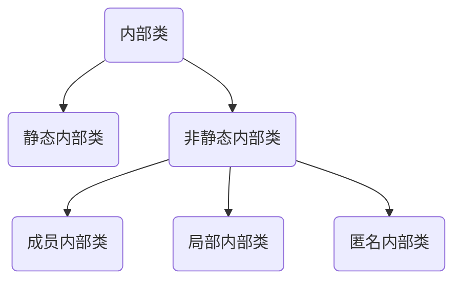
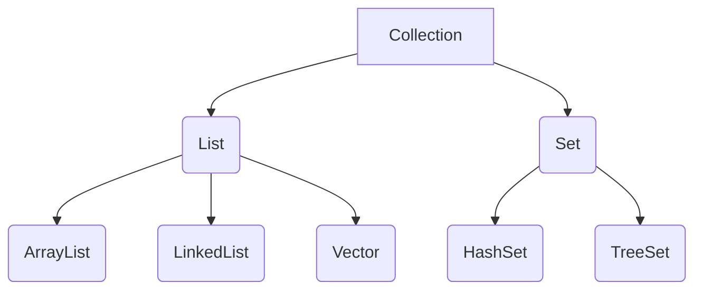
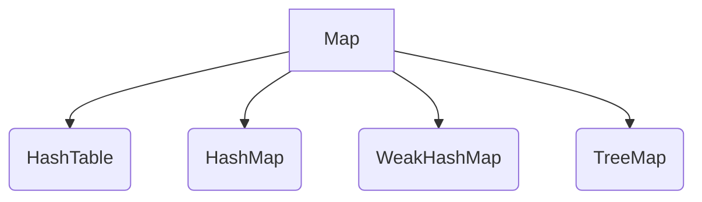

# 什么是面向对象（OOP）？

面向对象编程是使用类，对象，继承性，多态性，封装性和抽象的一种程序设计方法。

首先我们要区分一下 “基于对象” 和 “面向对象” 的区别。

1. 基于对象，通常指的是对数据的封装，以及提供一组方法对封装过的数据操作。
2. 面向对象，则在基于对象的基础上增加了多态性。所谓多态，就是可以用统一的方法对不同的对象进行同样的操作。

> 参考文章：[什么是面向对象（OOP）？](https://www.jianshu.com/p/7a5b0043b035)

# Java 三大特性理解

## 封装

封装最好理解了。封装是面向对象的特征之一，是对象和类概念的主要特性。

封装，也就是把客观事物封装成抽象的类，并且类可以把自己的数据和方法只让可信的类或者对象操作，对不可信的进行信息隐藏。

## 继承

面向对象编程 (OOP) 语言的一个主要功能就是 “继承”。继承是指这样一种能力：它可以使用现有类的所有功能，并在无需重新编写原来的类的情况下对这些功能进行扩展。

通过继承创建的新类称为 “子类” 或 “派生类”。

被继承的类称为 “基类”、“父类” 或 “超类”。

继承的过程，就是从一般到特殊的过程。

## 多态

多态性（polymorphisn）是允许你将父对象设置成为和一个或更多的他的子对象相等的技术，赋值之后，父对象就可以根据当前赋值给它的子对象的特性以不同的方式运作。简单的说，就是一句话：允许将子类类型的指针赋值给父类类型的指针。

实现多态，有二种方式，覆盖，重载。

覆盖，是指子类重新定义父类的虚函数的做法。

重载，是指允许存在多个同名函数，而这些函数的参数表不同（或许参数个数不同，或许参数类型不同，或许两者都不同）。

# 什么是多态？实现多态的机制是什么？

多态即：事物在运行过程中存在不同的状态。多态可以分为编译时多态和运行时多态，编译时多态是指方法的重载，运行时多态是指方法的重写。

对于运行时多态需要满足以下三个条件：

1. 要有继承关系
2. 子类重写父类方法
3. 父类对象的引用指向子类对象（SuperClass class = new ChildClass () ）

那么多态实现的机制是什么呢？

其实就是依靠静态分派和动态分派。

静态分派即在编译期间就能完全确定，在类加载的解析阶段就会把所涉及的符号引用转化为可确定的直接引用，不会延迟到运行期再去完成，典型的例子就是方法重载。

动态分派是指在运行期间才能确定变量的实际类型，典型的例子就是方法的重写。只有在运行期间，根据对实例化子类的不同，调用不同子类中重写的方法。

> 参考文章：[多态性实现机制 —— 静态分派与动态分派](https://www.jianshu.com/p/1976b01c07d2)

# 接口（Interface）与抽象类（Abstract Class）的区别？

抽象类是一个可同时包含具体方法和抽象方法 (方法未被实现) 的类。抽象方法必须被该抽象类的子类实现。抽象类是可以继承的。

接口像是描述类的一张蓝图或者说是类的一种契约，它包含了许多空方法，这代表着它的所有的子类都应该拥有共同点。它的子类应该提供这些空方法的具体实现。一 个类需要用 implements 来实现接口，接口可以用 extends 来继承其他接口。

> 参考文章：[接口（Interface）与抽象类（Abstract Class）的区别？](https://www.jianshu.com/p/c4f023d02f0c)

# 重写（Override）与重载（Overload）的区别？

1. 覆盖是子类与父类之间的关系，是一种垂直关系；重载是同一个类中方法之间的关系，是水平关系
2. 覆盖只能由一个方法或者只能由一对方法产生关系；重载是多个方法之间的关系
3. 覆盖要求参数列表要相同；重载要求参数列表不同
4. 覆盖关系中，调用方法体是根据对象的类型（对象对应存储空间类型）决定，重载是根据调用的时候实参表和形参表来选择方法。

# 静态属性和静态方法是否可以被继承？是否可以被重写？为什么？

**首先静态属性和静态方法是可以被子类继承的，但静态属性不能被子类重写**。

重写的本质是动态绑定，即根据运行时对象的类型来决定调用哪个方法，而不是根据编译时的类型。静态方法属于类的，在编译阶段已经静态绑定到类上，表现出来就是通过类名.方法名进行访问；所以静态方法无法被子类重写。

# 什么是内部类？内部类、静态内部类、局部内部类和匿名内部类的区别及作用？

## 内部类



### 作用

1. 内部类可以很好的实现隐藏一般的非内部类，是不允许有 private 与protected权限的，但内部类可以;
2. 内部类拥有外围类的所有元素的访问权限 (private修饰也能访问);
3. 可是实现多重继承 (让多个内部类分别继承多个其他类，使外部类可以同时获取多个其他类的属性);
4. 可以避免修改接口而实现同一个类中两种同名方法的调用。(外部类继承，让内部类实现接口);

## 静态内部类

静态内部类除了访问权限修饰符比外围类多以外, 和外围类没有区别, 只是代码上将静态内部类组织在了外部类里面。

## 局部内部类

作为非静态内部类的一种特殊形式, 非静态内部类的所有限制对局部类同样成立。局部类不仅可以访问外部类的所有成员，还可以访问方法体的局部变量，但必须是final修饰的局部变量。

## 匿名内部类

为了免去给内部类命名，或者只想使用一次，就可以选择使用匿名内部类。

# == 和 equals () 和 hashCode () 的区别？

## ==

 == 号在比较基本数据类型时比较的是值，而用 == 号比较两个对象时比较的是两个对象的地址值

```java
int x = 10;
int y = 10;
String str1 = new String("abc");
String str2 = new String("abc");
System.out.println(x == y); // 输出true
System.out.println(str1 == str2); // 输出false
```

## equals（）

equals () 其实，Object 的 equals 方法，内部就是使用 == 来判断两个对象是否相等的，故 equals 比较的也是两个对象的地址值

```java
public boolean equals(Object obj) {
   return (this == obj);
}
```

## hashCode ()

hashCode () 方法是通过对象在内存中的地址，算出对象的哈希码值，并将其返回。该方法一般是在集合类中操作，以提高查询效率。

## 关系

那么 equals () 和 hashcode () 有什么关系呢，其实如果你不重写 equals () 方法，他们之前谈不上任何关系。但是，当你想要重写 equals () 方法时，你就得重写 hashcode () 方法，可是这是为什么呢？

我们以经典的 String 对象为例，我们都知道 String 对象重写了 equals () 方法，在调用 equals () 方法时，只比较两个字符串的值是否相等，若相等，就返回 true。那么问题来了，如果 String 只重写了 equals () 方法，而没有重写 hashcode () 方法，会怎么样？表面上看好像对我们使用 equals () 比较时没有任何影响，但是当我们使用集合（以 HashSet 为例）来保存 String 对象时，HashSet 是通过对象的 hashcode 来保存对象的，当我们存入两个值相等的 String 对象时，由于我们没有重写 String 的 hashcode () 方法，他们的哈希码值是不相等的，所以两个值相等的 String 对象被存入到 HashSet 中，这和 set 集合保存的对象不能相等是相违背的。因此我们在重写 equals () 方法时，还得重写 hashcode () 方法。

# 并行和并发有什么区别

并行：多个处理器或多核处理器同时处理多个任务。

并发：多个任务在同一个 CPU 核上，按细分的时间片轮流 (交替) 执行，从逻辑上来看那些任务是同时执行。

举例： 并发 = 两个队列和一台咖啡机。 并行 = 两个队列和两台咖啡机。

# 为什么 Java 中不支持多重继承

多继承虽然能使子类同时拥有多个父类的特征，但是其缺点也是很显著的，主要有两方面：

1. 如果在一个子类继承的多个父类中拥有相同名字的实例变量，子类在引用该变量时将产生歧义，无法判断应该使用哪个父类的变量
2. 如果在一个子类继承的多个父类中拥有相同方法，子类中有没有覆盖该方法，那么调用该方法时将产生歧义，无法判断应该调用哪个父类的方法 正因为有以上的致命缺点，所以 java 中禁止一个类继承多个父类

> 参考文档
>
> 1. [知乎](https://www.zhihu.com/question/24317891)
> 2. [Break 易站](https://www.breakyizhan.com/java/4226.html)

# String 为什么要设计成不可变的？

1. 字符串池的需求字符串池是方法区（Method Area）中的一块特殊的存储区域。当一个字符串已经被创建并且该字符串在池中，该字符串的引用会立即返回给变量，而不是重新创建一个字符串再将引用返回给变量。如果字符串不是不可变的，那么改变一个引用（如: string2）的字符串将会导致另一个引用（如: string1）出现脏数据。
2. 允许字符串缓存哈希码在 java 中常常会用到字符串的哈希码，例如： HashMap 。String 的不变性保证哈希码始终一，因此，他可以不用担心变化的出现。 这种方法意味着不必每次使用时都重新计算一次哈希码 —— 这样，效率会高很多。
3. 安全 String 广泛的用于 java 类中的参数，如：网络连接（Network connetion），打开文件（opening files ）等等。如果 String 不是不可变的，网络连接、文件将会被改变 —— 这将会导致一系列的安全威胁。操作的方法本以为连接上了一台机器，但实际上却不是。由于反射中的参数都是字符串，同样，也会引起一系列的安全问题。

# 父类的静态方法能否被子类重写？
不能，父类的静态方法能够被子类继承，但是不能够被子类重写，即使子类中的静态方法与父类中的静态方法完全一样，也是两个完全不同的方法。

静态方法和静态变量在编译的时候就将其与类绑定在一起。既然它们在编译的时候就决定了调用的方法、变量，那就和重写没有关系了。

## 静态属性和静态方法是否可以被继承

可以被继承，如果子类中有相同的静态方法和静态变量，那么父类的方法以及变量就会被覆盖。要想调用就就必须使用父类来调用。

子类中覆盖了父类的静态方法的话，调用的是子类的方法，这个时候要是还想调用父类的静态方法，应该是用父类直接调用。如果子类没有覆盖，则调用的是父类的方法。静态变量与此相似。

# Integer 和 int 之间的区别？
1. Integer 是 int 的包装类，int 则是 Java 的一种基本数据类型
2. Integer 变量必须实例化之后才可以使用，而 int 变量不需要
3. Integer 实际是对象的引用，当 new 一个 Integer 时，实际上是生成一个指针指向此对象；而 int 则是直接存储数据值
4. Integer 的默认值是 null，int 的默认值是 0

# final、finally 和 finalize 的区别？

## **final** 

java 中，final 可以用来修饰类、方法和变量，意为 最后的、最终的 关键字。

### 修饰类

当用final修饰类的时，表明该类不能被其他类所继承。当我们需要让一个类永远不被继承，此时就可以用final修饰

**注意：final类中所有的成员方法都会隐式的定义为final方法。**

### 修饰方法

- 把方法锁定，以防止继承类对其进行更改。
- 早期版本中使用 final 修饰关键子可以优化性能。（存疑）

### 修饰变量

final 成员变量表示常量，只能被赋值一次，赋值后其值不再改变。类似于 C++ 中的 const。

## finally

finally作为异常处理的一部分，它只能用在try/catch语句中，并且附带一个语句块，表示这段语句最终一定会被执行（不管有没有抛出异常）

**注意：这里并不是绝对会被执行，如果在 try 没被执行的情况下 finally 并不会被执行，在比如在 try 中执行了 System.exit (0) 之后也不会**

## finalize

这个方法在 gc 启动，该对象被回收的时候被调用，一般情况下不需要去实现`finalize`

只有特殊情况下需要用到，比如：一个socket链接，在对象初始化时创建，整个生命周期内有效，那么就需要实现finalize，关闭这个链接。 

# List、Set、Map 的区别？

## Collection

## Map



## 总结
Collection:
每个位置只有一个元素。
Map:
持有 key-value pair，像个小型数据库。
List：
将以特定次序存储元素。所以取出来的顺序可能和放入顺序不同。
Set：
不能含有重复的元素

# String 转换成 Integer 的方式及原理？

`integer.parseInt(string str)`方法调用Integer内部的
`parseInt(string str,10)`方法,默认基数为 10，parseInt 内部首先
判断字符串是否包含符号（- 或者 +），则对相应的 negative 和 limit 进行
赋值，然后再循环字符串，对单个 char 进行数值计算`Character.digit(char ch, int radix)`
在这个方法中，函数肯定进入到0-9字符的判断（相对于 string 转换到 int），
否则会抛出异常，数字就是如上面进行拼接然后生成的int类型数值。


