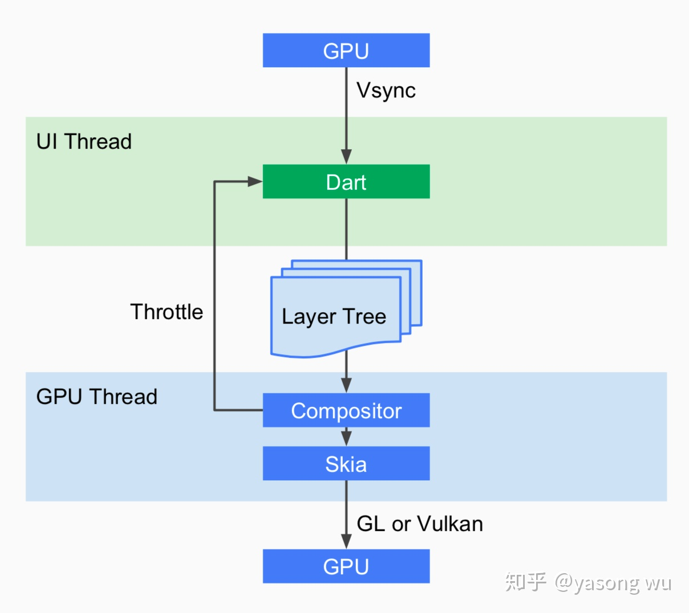

# 总体架构

## Engine

Skia：图像UI框架

Dart：虚拟机

Text：纹理渲染器

## Framework

### Foundational 

基础的 foundational 类及一些基层之上的构建块服务，如 animation(动画)、 painting（画布） 和 gestures（手势），它们可以提供上层常用的抽象。

### Rendering

渲染层用于提供操作布局的抽象。有了渲染层，你可以构建一棵可渲染对象的树。在你动态更新这些对象时，渲染树也会自动根据你的变更来更新布局。

### widget 

widget 层是一种组合的抽象。每一个渲染层中的渲染对象，都在 widgets 层中有一个对应的类。此外，widgets 层让你可以自由组合你需要复用的各种类。响应式编程模型就在该层级中被引入。

### Material 和 Cupertino

Material 和 Cupertino 库提供了全面的 widgets 层的原语组合，这套组合分别实现了 Material 和 iOS 设计规范。

# GPU 渲染流程

GPU 的 VSync 信号同步给到 UI 线程，UI 线程使用 Dart 来构建抽象的视图结构（这里是 Framework 层的工作），绘制好的抽象视图数据结构在 GPU 线程中进行图层合成（在 Flutter Engine 层的工作），然后提供给 Skia 引擎渲染为 GPU 数据，最后通过 OpenGL 或者 Vulkan 提供给 GPU。

# 状态控制

## App的生命周期

可以通过 **WidgetsBindingObserver** 来对 App 的生命周期进行监听

- resumed: 应用可见并可响应用户操作
- inactive: 用户可见，但不可响应用户操作
- paused: 已经暂停了，用户不可见、不可操作
- suspending：应用被挂起，此状态 IOS 永远不会回调 Widget 的生命周期

## Widget 的生命周期

### StatelessWidget （没有状态变化的界面）

生命周期只有一个 `build`，build 是用来创建 Widget 的，但因为 build 在每次界面刷新的时候都会调用，所以不要在 build 里写业务逻辑，可以把业务逻辑写到你的 StatelessWidget 的构造函数里。

### StatefulWidget 有状态的界面

- createState
- initState
- didChangeDependencies
- build
- addPostFrameCallback
- didUpdateWidget
- deactivate
- dispose

#### createState

createState 是 StatefulWidget 里创建 State 的方法，当要创建新的 StatefulWidget 的时候，会立即执行 createState，而且只执行一次，createState 必须要实现

#### initState

前面的 createState 是在创建 StatefulWidget 的时候会调用，initState 是 StatefulWidget 创建完后调用的第一个方法，而且只执行一次，类似于 Android 的 onCreate、iOS 的 viewDidLoad ()，所以在这里 View 并没有渲染，但是这时 StatefulWidget 已经被加载到渲染树里了，这时 StatefulWidget 的 **mount** 的值会变为 true，直到 **dispose** 调用的时候才会变为 false。可以在 initState 里做一些初始化的操作。

#### didChangeDependencies

当 StatefulWidget 第一次创建的时候，didChangeDependencies 方法会在 initState 方法之后立即调用，之后当 StatefulWidget 刷新的时候，就不会调用了，除非你的 StatefulWidget 依赖的 InheritedWidget 发生变化之后，****didChangeDependencies**** 才会调用，所以 ****didChangeDependencies**** 有可能会被调用多次。

#### build

在 StatefulWidget 第一次创建的时候，build 方法会在 didChangeDependencies 方法之后立即调用，另外一种会调用 build 方法的场景是，每当 UI 需要重新渲染的时候，build 都会被调用，所以 build 会被多次调用，然后 返回要渲染的 Widget。千万不要在 build 里做除了创建 Widget 之外的操作，因为这个会影响 UI 的渲染效率。

#### addPostFrameCallback

addPostFrameCallback 是 StatefulWidge 渲染结束的回调，只会被调用一次，之后 StatefulWidget 需要刷新 UI 也不会被调用，addPostFrameCallback 的使用方法是在 initState 里添加回调

#### didUpdateWidget

didUpdateWidget 这个生命周期一般不会用到，只有在使用 key 对 Widget 进行复用的时候才会调用。

#### deactivate

当要将 State 对象从渲染树中移除的时候，就会调用 deactivate 生命周期，这标志着 StatefulWidget 将要销毁，但是有时候 State 不会被销毁，而是重新插入到渲染树种。

#### dispose

当 View 不需要再显示，从渲染树中移除的时候，State 就会永久的从渲染树中移除，就会调用 **dispose** 生命周期，这时候就可以在 dispose 里做一些取消监听、动画的操作，和 initState 是相反的。