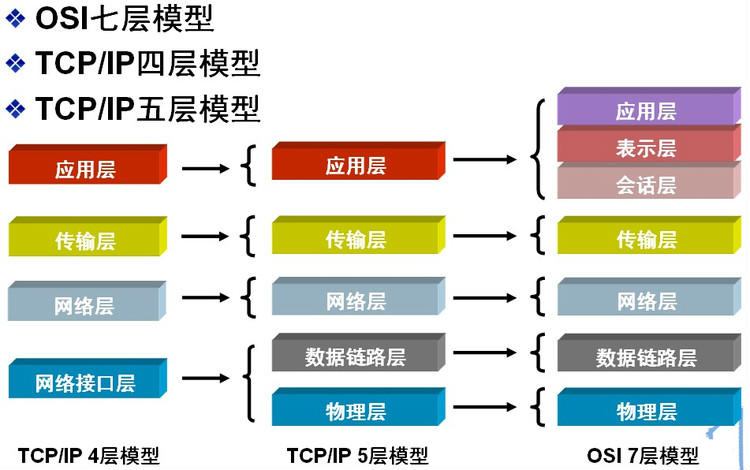

# 概述

互联网在多次迭代形成了现在这个样子，我们作为互联网的民工，需要对互联网的基本组成和结构体系了解并掌握，本文章主要的目的就就让你对互联网的基本组成有一个大概的了解。

而计算机网络学习的核心内容就是网络协议的学习。网络协议是为计算机网络中进行数据交换而建立的规则、标准或者说是约定的集合。因为不同用户的数据终端可能采取的字符集是不同的，两者需要进行通信，必须要在一定的标准上进行。一个很形象地比喻就是我们的语言，我们大天朝地广人多，地方性语言也非常丰富，而且方言之间差距巨大。A地区的方言可能B地区的人根本无法接受，所以我们要为全国人名进行沟通建立一个语言标准，这就是我们的普通话的作用。同样，放眼全球，我们与外国友人沟通的标准语言是英语，所以我们才要苦逼的学习英语。

# 网络层次划分

| 分层                              | 说明                                                         |
| :-------------------------------- | :----------------------------------------------------------- |
| 应用层（HTTP、FTP、DNS、SMTP 等） | 定义了如何包装和解析数据，应用层是 http 协议的话，则会按照协议规定包装数据，如按照请求行、请求头、请求体包装，包装好数据后将数据传至运输层 |
| 运输层（TCP、UDP 等）             | 运输层有 TCP 和 UDP 两种，分别对应可靠和不可靠的运输。在这一层，一般都是和 Socket 打交道，Socket 是一组封装的编程调用接口，通过它，我们就能操作 TCP、UDP 进行连接的建立等。这一层指定了把数据送到对应的端口号 |
| 网络层（IP 等）                   | 这一层IP协议，以及一些路由选择协议等等，所以这一层的指定了数据要传输到哪个IP地址。中间涉及到一些最优线路，路由选择算法等 |
| 数据链路层（ARP）                 | 负责把 IP 地址解析为 MAC 地址，即硬件地址，这样就找到了对应的唯一的机器 |
| 物理层                            | 提供二进制流传输服务，也就是真正开始通过传输介质（有线、无线）开始进行数据的传输 |

我这里写的是 TCP/IP 五层模型当然还有四层模型以及 OSI 七成模型他们都有对应关系：



# IP层

## 网络地址

IP地址由网络号（包括子网号）和主机号组成，网络地址的主机号为全0，网络地址代表着整个网络。

## 广播地址

广播地址通常称为直接广播地址，是为了区分受限广播地址。

广播地址与网络地址的主机号正好相反，广播地址中，主机号为全1。当向某个网络的广播地址发送消息时，该网络内的所有主机都能收到该广播消息。

## 组播地址

D类地址就是组播地址。

先回忆下A，B，C，D类地址吧：

A类地址以0开头，第一个字节作为网络号，地址范围为：0.0.0.0~127.255.255.255；(**modified @2016.05.31**)

B类地址以10开头，前两个字节作为网络号，地址范围是：128.0.0.0~191.255.255.255;

C类地址以110开头，前三个字节作为网络号，地址范围是：192.0.0.0~223.255.255.255。

D类地址以1110开头，地址范围是224.0.0.0~239.255.255.255，D类地址作为组播地址（一对多的通信）；

E类地址以1111开头，地址范围是240.0.0.0~255.255.255.255，E类地址为保留地址，供以后使用。

注：**只有A,B,C有网络号和主机号之分，D类地址和E类地址没有划分网络号和主机号。**

## 255.255.255.255

该IP地址指的是受限的广播地址。受限广播地址与一般广播地址（直接广播地址）的区别在于，受限广播地址只能用于本地网络，路由器不会转发以受限广播地址为目的地址的分组；一般广播地址既可在本地广播，也可跨网段广播。例如：主机192.168.1.1/30上的直接广播数据包后，另外一个网段192.168.1.5/30也能收到该数据报；若发送受限广播数据报，则不能收到。

注：**一般的广播地址（直接广播地址）能够通过某些路由器（当然不是所有的路由器），而受限的广播地址不能通过路由器。**

## 0.0.0.0

常用于寻找自己的IP地址，例如在我们的RARP，BOOTP和DHCP协议中，若某个未知IP地址的无盘机想要知道自己的IP地址，它就以255.255.255.255为目的地址，向本地范围（具体而言是被各个路由器屏蔽的范围内）的服务器发送IP请求分组。

### 回环地址

127.0.0.0/8被用作回环地址，回环地址表示本机的地址，常用于对本机的测试，用的最多的是127.0.0.1。

## A、B、C类私有地址

私有地址(private address)也叫专用地址，它们不会在全球使用，只具有本地意义。

A类私有地址：10.0.0.0/8，范围是：10.0.0.0~10.255.255.255

B类私有地址：172.16.0.0/12，范围是：172.16.0.0~172.31.255.255

C类私有地址：192.168.0.0/16，范围是：192.168.0.0~192.168.255.255

# 子网掩码及网络划分

# ARP/RARP协议

# 路由选择协议

# TCP/IP协议

**TCP/IP协议是Internet最基本的协议、Internet国际互联网络的基础，由网络层的IP协议和传输层的TCP协议组成。通俗而言：TCP负责发现传输的问题，一有问题就发出信号，要求重新传输，直到所有数据安全正确地传输到目的地。而IP是给因特网的每一台联网设备规定一个地址。**

　　IP层接收由更低层（网络接口层例如以太网设备驱动程序）发来的数据包，并把该数据包发送到更高层---TCP或UDP层；相反，IP层也把从TCP或UDP层接收来的数据包传送到更低层。IP数据包是不可靠的，因为IP并没有做任何事情来确认数据包是否按顺序发送的或者有没有被破坏，IP数据包中含有发送它的主机的地址（源地址）和接收它的主机的地址（目的地址）。

 　TCP是面向连接的通信协议，通过三次握手建立连接，通讯完成时要拆除连接，由于TCP是面向连接的所以只能用于端到端的通讯。TCP提供的是一种可靠的数据流服务，采用“带重传的肯定确认”技术来实现传输的可靠性。TCP还采用一种称为“滑动窗口”的方式进行流量控制，所谓窗口实际表示接收能力，用以限制发送方的发送速度。

## 三次握手（开始）

### 第一次握手(SYN=1, seq=x):

客户端发送一个 TCP 的 SYN 标志位置 1 的包，指明客户端打算连接的服务器的端口，以及初始序号 X，保存在包头的序列号 (Sequence Number) 字段里。

发送完毕后，客户端进入 `SYN_SEND` 状态。

### 第二次握手(SYN=1, ACK=1, seq=y, ACKnum=x+1):

服务器发回确认包(ACK)应答。即 SYN 标志位和 ACK 标志位均为 1。服务器端选择自己 ISN 序列号，放到 Seq 域里，同时将确认序号(Acknowledgement Number)设置为客户的 ISN 加1，即 X+1。 发送完毕后，服务器端进入 `SYN_RCVD` 状态。

### 第三次握手(ACK=1，ACKnum=y+1)：

客户端再次发送确认包(ACK)，SYN 标志位为 0，ACK 标志位为 1，并且把服务器发来 ACK 的序号字段 +1，放在确定字段中发送给对方，并且在数据段放写 ISN 的 +1

发送完毕后，客户端进入 ESTABLISHED 状态，当服务器端接收到这个包时，也进入 ESTABLISHED 状态，TCP 握手结束。

## 四次挥手（结束）

### 第一次挥手(FIN=1，seq=x)

假设客户端想要关闭连接，客户端发送一个 FIN 标志位置为1的包，表示自己已经没有数据可以发送了，但是仍然可以接受数据。

发送完毕后，客户端进入 FIN_WAIT_1 状态。

### 第二次挥手(ACK=1，ACKnum=x+1)

服务器端确认客户端的 FIN 包，发送一个确认包，表明自己接受到了客户端关闭连接的请求，但还没有准备好关闭连接。

发送完毕后，服务器端进入 CLOSE_WAIT 状态，客户端接收到这个确认包之后，进入 FIN_WAIT_2 状态，等待服务器端关闭连接。

### 第三次挥手(FIN=1，seq=y)

服务器端准备好关闭连接时，向客户端发送结束连接请求，FIN 置为1。

发送完毕后，服务器端进入 LAST_ACK 状态，等待来自客户端的最后一个ACK

### 第四次挥手(ACK=1，ACKnum=y+1)

客户端接收到来自服务器端的关闭请求，发送一个确认包，并进入 TIME_WAIT状态，等待可能出现的要求重传的 ACK 包。

服务器端接收到这个确认包之后，关闭连接，进入 CLOSED 状态。

客户端等待了某个固定时间（两个最大段生命周期，2MSL，2 Maximum Segment Lifetime）之后，没有收到服务器端的 ACK ，认为服务器端已经正常关闭连接，于是自己也关闭连接，进入 CLOSED 状态。

# UDP协议　

**UDP用户数据报协议，是面向无连接的通讯协议，UDP数据包括目的端口号和源端口号信息，由于通讯不需要连接，所以可以实现广播发送。UDP通讯时不需要接收方确认，属于不可靠的传输，可能会出现丢包现象，实际应用中要求程序员编程验证。**

UDP与TCP位于同一层，但它不管数据包的顺序、错误或重发。因此，UDP不被应用于那些使用虚电路的面向连接的服务，UDP主要用于那些面向查询---应答的服务，例如NFS。相对于FTP或Telnet，这些服务需要交换的信息量较小。

每个UDP报文分UDP报头和UDP数据区两部分。报头由四个16位长（2字节）字段组成，分别说明该报文的源端口、目的端口、报文长度以及校验值。UDP报头由4个域组成，其中每个域各占用2个字节，具体如下：

1. 源端口号；
2. 目标端口号；
3. 数据报长度；
4. 校验值。

使用UDP协议包括：TFTP（简单文件传输协议）、SNMP（简单网络管理协议）、DNS（域名解析协议）、NFS、BOOTP。

# TCP 和 UDP 区别

| 区别点   | TCP                                    | UDP                            |
| -------- | -------------------------------------- | ------------------------------ |
| 连接性   | 面向连接                               | 无连接                         |
| 可靠性   | 可靠                                   | 不可靠                         |
| 有序性   | 有序                                   | 无序                           |
| 面向     | 字节流                                 | 报文（保留报文边界）           |
| 有界性   | 有界                                   | 无界                           |
| 流量控制 | 有（滑动窗口）                         | 无                             |
| 拥塞控制 | 有（慢开始、拥塞避免、快重传、快恢复） | 无                             |
| 传输速度 | 慢                                     | 快                             |
| 量级     | 重量级                                 | 轻量级                         |
| 双工性   | 全双工                                 | 一对一、一对多、多对一、多对多 |
| 头部     | 打（20 - 60字节）                      | 小（8 字节）                   |
| 应用     | 文件传输、邮件传输、浏览器等           | 即时通讯、视频通话等           |


#  DNS协议

DNS是域名系统(DomainNameSystem)的缩写，该系统用于命名组织到域层次结构中的计算机和网络服务，**可以简单地理解为将URL转换为IP地址**。域名是由圆点分开一串单词或缩写组成的，每一个域名都对应一个惟一的IP地址，在Internet上域名与IP地址之间是一一对应的，DNS就是进行域名解析的服务器。DNS命名用于Internet等TCP/IP网络中，通过用户友好的名称查找计算机和服务。

# NAT协议

NAT网络地址转换(Network Address Translation)属接入广域网(WAN)技术，是一种将私有（保留）地址转化为合法IP地址的转换技术，它被广泛应用于各种类型Internet接入方式和各种类型的网络中。原因很简单，NAT不仅完美地解决了lP地址不足的问题，而且还能够有效地避免来自网络外部的攻击，隐藏并保护网络内部的计算机。

# DHCP协议

DHCP动态主机设置协议（Dynamic Host Configuration Protocol）是一个局域网的网络协议，使用UDP协议工作，主要有两个用途：给内部网络或网络服务供应商自动分配IP地址，给用户或者内部网络管理员作为对所有计算机作中央管理的手段。

# HTTP协议

## HTTP

超文本传输协议（HTTP，HyperText Transfer Protocol)是互联网上应用最为广泛的一种网络协议。所有的WWW文件都必须遵守这个标准。

### HTTP 协议包括哪些请求？

- **GET：请求读取由URL所标志的信息。**
- **POST：给服务器添加信息（如注释）。**
- PUT：在给定的URL下存储一个文档。
- DELETE：删除给定的URL所标志的资源。
- HEAD： 类似于get请求，只不过返回的响应中没有具体的内容，用于获取报头。
- CONNECT：HTTP/1.1协议中预留给能够将连接改为管道方式的代理服务器。
- OPTIONS：允许客户端查看服务器的性能。
- TRACE：回显服务器收到的请求，主要用于测试或诊断。

### HTTP **中，** POST **与** GET **的区别**

1. Get是从服务器上获取数据，Post是向服务器传送数据。

2. Get是把参数数据队列加到提交表单的Action属性所指向的URL中，值和表单内各个字段一一对应，在URL中可以看到。

3. Get传送的数据量小，不能大于2KB；Post传送的数据量较大，一般被默认为不受限制。

4. 根据HTTP规范，GET用于信息获取，而且应该是安全的和幂等的。
   1. 所谓 **安全的** 意味着该操作用于获取信息而非修改信息。换句话说，GET请求一般不应产生副作用。就是说，它仅仅是获取资源信息，就像数据库查询一样，不会修改，增加数据，不会影响资源的状态。
   2. **幂等** 的意味着对同一URL的多个请求应该返回同样的结果。

## HTTPS

单讲是HTTP的安全版，即HTTP下加入SSL层，HTTPS的安全基础是SSL，因此加密的详细内容就需要SSL。

### 同 HTTP 的区别

1. https协议需要到ca申请证书，一般免费证书较少，因而需要一定费用。
2. http是超文本传输协议，信息是明文传输，https则是具有安全性的ssl加密传输协议。
3. http和https使用的是完全不同的连接方式，用的端口也不一样，前者是80，后者是443。
4. http的连接很简单，是无状态的；HTTPS协议是由SSL+HTTP协议构建的可进行加密传输、身份认证的网络协议，比http协议安全。

### 工作原理

客户端在使用HTTPS方式与Web服务器通信时有以下几个步骤：

1. 客户使用https的URL访问Web服务器，要求与Web服务器建立SSL连接。
2. Web服务器收到客户端请求后，会将网站的证书信息（证书中包含公钥）传送一份给客户端。
3. 客户端的浏览器与Web服务器开始协商SSL连接的安全等级，也就是信息加密的等级。
4. 客户端的浏览器根据双方同意的安全等级，建立会话密钥，然后利用网站的公钥将会话密钥加密，并传送给网站。
5. Web服务器利用自己的私钥解密出会话密钥。
6. Web服务器利用会话密钥加密与客户端之间的通信。


### 优点

1. 使用HTTPS协议可认证用户和服务器，确保数据发送到正确的客户机和服务器；
2. HTTPS协议是由SSL+HTTP协议构建的可进行加密传输、身份认证的网络协议，要比http协议安全，可防止数据在传输过程中不被窃取、改变，确保数据的完整性。
3. HTTPS是现行架构下最安全的解决方案，虽然不是绝对安全，但它大幅增加了中间人攻击的成本。
4. 谷歌曾在2014年8月份调整搜索引擎算法，并称“比起同等HTTP网站，采用HTTPS加密的网站在搜索结果中的排名将会更高”。

### 缺点

1. HTTPS协议握手阶段比较费时，会使页面的加载时间延长近50%，增加10%到20%的耗电；
2. HTTPS连接缓存不如HTTP高效，会增加数据开销和功耗，甚至已有的安全措施也会因此而受到影响；
3. SSL证书需要钱，功能越强大的证书费用越高，个人网站、小网站没有必要一般不会用。
4. SSL证书通常需要绑定IP，不能在同一IP上绑定多个域名，IPv4资源不可能支撑这个消耗。
5. HTTPS协议的加密范围也比较有限，在黑客攻击、拒绝服务攻击、服务器劫持等方面几乎起不到什么作用。最关键的，SSL证书的信用链体系并不安全，特别是在某些国家可以控制CA根证书的情况下，中间人攻击一样可行

# Socket

Socket 是一组操作 TCP/UDP 的 API，在 Android 中像 HttpURLConnection 和 Okhttp 这种涉及到比较底层的网络请求发送的，最终当然也都是通过 Socket 来进行网络请求连接发送，而像 Volley、Retrofit 则是更上层的封装

这里我就使用 Android 代码来做使用示例：

## 使用示例

使用 socket 的步骤如下：

- 创建 ServerSocket 并监听客户连接；
- 使用 Socket 连接服务端；
- 通过 Socket.getInputStream()/getOutputStream() 获取输入输出流进行通信。

```java
public class EchoClient {
 
    private final Socket mSocket;
 
    public EchoClient(String host, int port) throws IOException {
        // 创建 socket 并连接服务器
        mSocket = new Socket(host, port);
    }
 
    public void run() {
        // 和服务端进行通信
        Thread readerThread = new Thread(this::readResponse);
        readerThread.start();
 
        OutputStream out = mSocket.getOutputStream();
        byte[] buffer = new byte[1024];
        int n;
        while ((n = System.in.read(buffer)) > 0) {
            out.write(buffer, 0, n);
        }
    }

    private void readResponse() {
        try {
            InputStream in = mSocket.getInputStream();
            byte[] buffer = new byte[1024];
            int n;
            while ((n = in.read(buffer)) > 0) {
                System.out.write(buffer, 0, n);
            }
        } catch (IOException e) {
            e.printStackTrace();
        }
    }
 
 
    public static void main(String[] argv) {
        try {
            // 由于服务端运行在同一主机，这里我们使用 localhost
            EchoClient client = new EchoClient("localhost", 9877);
            client.run();
        } catch (IOException e) {
            e.printStackTrace();
        }
    }
}
```

这里我做一个简单的概述，后期会单独写一篇文章来阐述项目中我们该如何使用 socket 来开发。

