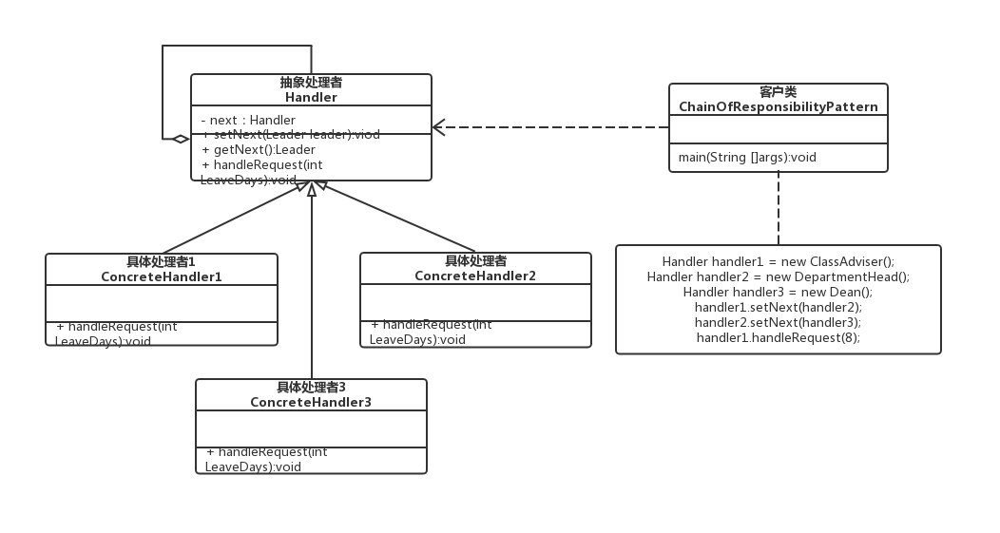
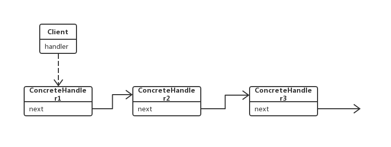

# 结构

职责链模式主要包含以下角色。

1. 抽象处理者（Handler）角色：定义一个处理请求的接口，包含抽象处理方法和一个后继连接。
2. 具体处理者（Concrete Handler）角色：实现抽象处理者的处理方法，判断能否处理本次请求，如果可以处理请求则处理，否则将该请求转给它的后继者。
3. 客户类（Client）角色：创建处理链，并向链头的具体处理者对象提交请求，它不关心处理细节和请求的传递过程。

## 结构图



## 流程图



# 代码

> [Demo.kt](Demo.kt) 

运行结果

```
具体处理者2负责处理该请求！
```


